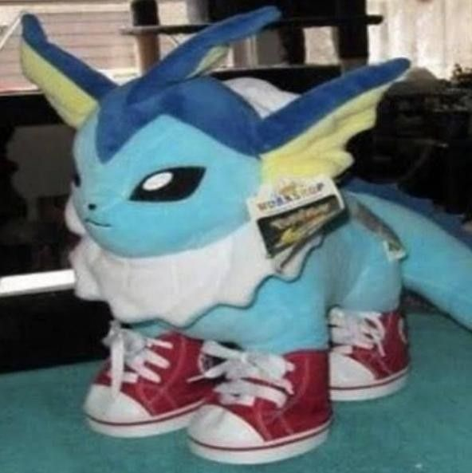

# Readme
<!--  -->

    

 

 # Vaporeon Dripado 

 Este readme serve para demonstrar essa incrivel dripiozidade

Conteúdo    

<ul>
    <li>
        <a
         href="descricacao"> Descrição
        </a>
    </li>
    <li>
        <a
        href="statusdoprojeto"> Stauts do projeto
        </a>
    </li>

 </ul>

 ## Status do projeto
 <h4
 id="statusdoprojeto"
 align="left">
    Em construção...
</h4>